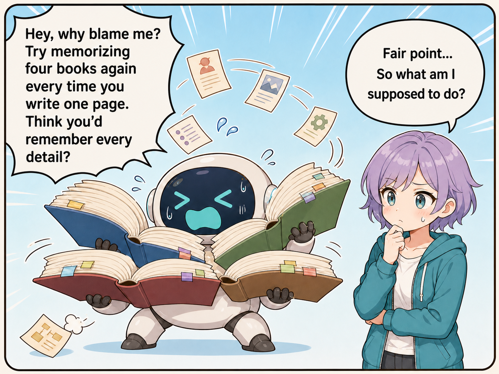
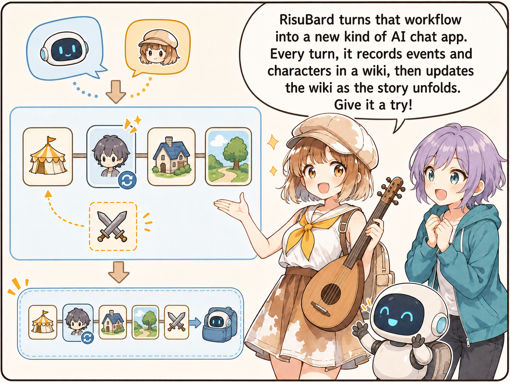

<p align="center">
  <strong>English</strong> · <a href="README.md">한국어</a>
</p>

<h1 align="center">
  
</h1>

<p align="center">
  A self-hosted AI roleplay frontend with bounded-context narrative memory.
</p>

<p align="center">
  <a href="https://github.com/rpaddict/RisuBard/releases"></a>
  <a href="https://github.com/rpaddict/RisuBard/actions/workflows/pr-check.yml"></a>
  <a href="LICENSE"></a>
</p>

<p align="center">
  <strong><a href="https://github.com/rpaddict/RisuBard/releases">Download</a></strong> ·
  <a href="docs/en/install.md">Installation</a> ·
  <a href="docs/en/migration.md">Migrate from RisuAI</a> ·
  <a href="https://github.com/rpaddict/RisuBard/issues">Issues</a>
</p>

RisuBard is built for character conversations that outgrow a model's context window. It preserves the original chat as evidence, maintains reusable narrative state in Obsidian-compatible Markdown, and compiles only the relevant memory into each bounded model request.

You keep the existing RisuAI ecosystem—characters, CHARX cards, lorebooks, modules, prompt presets, provider adapters, and plugin integration paths—while gaining a file-native storage architecture and a long-term memory system designed for persistent stories.

> RisuBard does not include or host an AI model. Connect a local model or a remote provider that you control.

## Contents

- [Why RisuBard?](#why-risubard)
- [How it works](#how-it-works)
- [Highlights](#highlights)
- [Quick start](#quick-start)
- [Compatibility and migration](#compatibility-and-migration)
- [Data and privacy](#data-and-privacy)
- [Documentation](#documentation)
- [Contributing](#contributing)
- [Lineage and license](#lineage-and-license)

## Why RisuBard?

<p align="center">
  
</p>

<p align="center">
  
</p>

<p align="center">
  
</p>

<p align="center">
  
</p>

Long-running character chats eventually collide with a simple constraint: a model request cannot keep growing forever. Re-sending the entire conversation becomes expensive and ultimately exceeds the model's context window. Replacing the past with a single rolling summary can fit the limit, but important state, causality, and character knowledge may disappear.

RisuBard separates three responsibilities:

- **Original chat** is preserved as evidence and history.
- **BardWiki** stores durable narrative state as readable Markdown.
- **Model context** is compiled for each request under explicit token limits.

The result is a conversation whose stored history can continue growing without making the prompt budget grow with it.

## How it works

```text
Confirmed conversation
  ├─ original messages remain available as evidence
  └─ durable events and state update the Markdown BardWiki

Next model request
  ├─ character and world foundation
  ├─ current scene
  ├─ relevant BardWiki documents
  ├─ a bounded window of recent messages
  └─ the current user input
             │
             ▼
      fixed-budget compiler
             │
             ▼
      your configured model
```

Required context is never silently discarded. Optional memories are selected by relevance and priority, and the budget does not automatically expand with chat length or wiki size. A request manifest records what was included, excluded, or truncated without storing API keys or hidden reasoning.

## Highlights

### Bounded-context narrative memory

- Explicit limits for recent messages, selected memory, analysis input, and response reservation
- Relevant memories selected per request instead of replaying the complete history
- Safe fallback to character foundations and recent messages if memory inquiry fails

### Markdown BardWiki

- Obsidian-compatible Markdown for characters, locations, factions, items, concepts, scenes, and events
- Automatic narrative analysis plus direct human editing
- Per-document `always`, `auto`, and `never` context policies
- History, snapshots, trash, health checks, and hash-safe conflict protection

### File-native user data

- Canonical JSON, JSONL, Markdown, and content-addressed assets instead of SQLite or one database blob
- Lazy loading for characters, chats, assets, and indexes
- Atomic writes, recoverable journals, revisions, and trash-based deletion
- Rebuildable compatibility projections for inherited clients and exports

### RisuAI ecosystem compatibility

- CHARX character cards, lorebooks, modules, prompt presets, and existing provider paths
- Legacy `.bin`, save-folder, and optional `risuai.db` migration paths
- Compatibility export for moving data back into existing workflows
- Existing module and plugin integration boundaries preserved

### Self-hosted and portable

- Portable packages for Windows x64, Linux x64/ARM64, and macOS Apple Silicon
- Docker, source installation, and Android Termux guides
- Optional update notification and self-update support for portable packages

## Quick start

The portable package is the simplest way to run RisuBard. It does not require Node.js or Docker.

1. Open [GitHub Releases](https://github.com/rpaddict/RisuBard/releases).
2. Download and extract the package for your platform.
3. Start RisuBard and open `http://localhost:6001`.

| Platform | Package | Start |
| --- | --- | --- |
| Windows x64 | `RisuBard-vX.Y.Z-win-x64.zip` | Double-click `RisuBard.exe` |
| Linux x64 | `RisuBard-vX.Y.Z-linux-x64.tar.gz` | Run `./start.sh` |
| Linux ARM64 | `RisuBard-vX.Y.Z-linux-arm64.tar.gz` | Run `./start.sh` |
| macOS Apple Silicon | `RisuBard-vX.Y.Z-macos-arm64.tar.gz` | Open `RisuBard.app` |

For Docker, source builds, remote access, updates, and platform-specific requirements, read the [complete installation guide](docs/en/install.md).

## Compatibility and migration

RisuBard is designed to extend an existing collection rather than strand it. The migration tools accept a normal RisuAI `.bin` backup, a zipped Node save folder, or a direct save-folder copy for large installations.

Back up the source installation before migrating, then follow the [RisuAI migration guide](docs/en/migration.md). Imports are validated before they replace active data, and the original `risuai.db` is copied to migration backups before an optional one-time extraction.

Compatibility is a release gate: automated suites cover backup round-trips, cold storage, remote blocks, settings-only exports, legacy presets, CHARX-related application paths, modules, and plugins.

## Data and privacy

RisuBard runs on infrastructure you control and stores canonical user data as ordinary files under its data root. You can set a separate absolute path with `RISUBARD_DATA_ROOT`; application code and user data do not need to share a directory.

Model traffic follows the provider you configure. Requests sent to a remote model provider are subject to that provider's data policy; requests to a local model remain within the environment you operate. RisuBard's request logs omit request and response bodies, authentication headers, URLs, API keys, and hidden reasoning.

Read [File-native user data](docs/en/file-native-storage.md) for the storage tree, crash-safety guarantees, backup behavior, and Termux restrictions.

## Documentation

| Topic | English | 한국어 |
| --- | --- | --- |
| Installation and updates | [Installation](docs/en/install.md) | [설치](docs/ko/install.md) |
| Migrating from RisuAI | [Migration](docs/en/migration.md) | [데이터 이전](docs/ko/migration.md) |
| BardWiki memory | — | [메모리 사용 안내](docs/ko/memory-wiki.md) |
| File-native storage | [Storage](docs/en/file-native-storage.md) | [파일 정본 저장](docs/ko/file-native-storage.md) |
| Remote access | [Remote access](docs/en/remote.md) | [원격 접속](docs/ko/remote.md) |
| Android | [Termux](docs/en/termux.md) | [Termux](docs/ko/termux.md) |
| Architecture | [Code boundaries](docs/architecture/code-boundaries.md) | [Code boundaries](docs/architecture/code-boundaries.md) |

Additional translated installation and migration guides are available in `docs/de`, `docs/cn`, `docs/es`, `docs/vi`, and `docs/zh-Hant`.

## Project status

RisuBard is under active development. Keep a current backup before migrating important data, and check the [release notes](https://github.com/rpaddict/RisuBard/releases) for changes that affect storage or compatibility.

The repository validates releases with Svelte and TypeScript checks, browser and server unit tests, compatibility round-trips, and a production build.

## Contributing

Issues, design discussions, documentation improvements, tests, and pull requests are welcome. For a substantial behavioral or architectural change, open an issue first so that compatibility and migration requirements can be agreed on before implementation.

Before submitting code, run:

```bash
pnpm install --frozen-lockfile
pnpm check
pnpm test
pnpm test:compat
pnpm build
```

Changes must preserve existing CHARX, module, plugin, preset, and import/export compatibility unless an explicit migration path is included.

## Lineage and license

RisuBard is built on inherited GPLv3 RisuAI code and retains that project's license obligations and attribution. Independently authored RisuBard components are kept behind documented code boundaries so that provenance remains inspectable as the architecture evolves.

This repository is licensed under **GNU General Public License v3.0 only**. See [LICENSE](LICENSE), [NOTICE.md](NOTICE.md), and the [code-boundary architecture](docs/architecture/code-boundaries.md).
